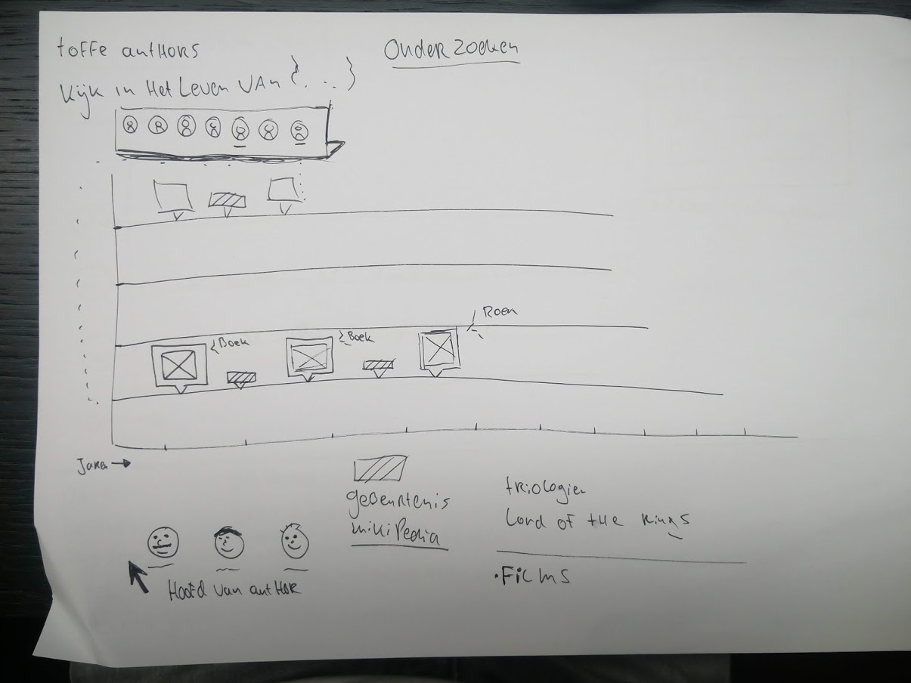
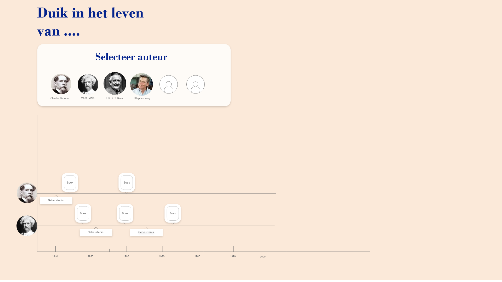

# Front-end data

## Table of contents
* [Concept & sketches 💭](#Concept-&-Sketches)
* [Process 🔁](#process)
* [Challenges ⚔](#Challenges)
* [To do's 📜](#To-do's)
* [The cool stuff 🧙‍](#Challenges)


### Concepts & Sketches 💭
After skethcing and brainstorming i first wanted to make a bar chart but. But i wanted to create something cooler, after some more sketching i came up with the idea that it would be very cool to see when authors have published their books in combination with life events.
Where people can click on an author and see their live timeline. On the x it plots their books and their life events like their first child or the year they we're born. On the y it plots the authors face so you can easily see who's timeline you're looking at.


This was the first sketch 




And a more designed wireframe



### Process 🔁

For me D3 had a very high learning curve i still find some concepts pretty complex. The first challenges was to create an chart that looked like a timechart. Where the x line would have the years this is a quite common chart so making this was not so hard. The only thing that was hard was building a function that creates a min max year from the authors inside the specific array.

 A mistake i often make is to not write out the process of what needs to happen. This resulted in being stuck on building the grid to plot the books on. After asking for help, i with some help started to build a function that filters the books from the specific authors array. And then plots the books on the correct year. This was working but the books plotted al on the same line. In my design the books needed to be on separate lines. So after some trying out different heights and options the books finaly plotted correctly.

But the books were al inside of rectangles for testing purposes, i needed the actual bookcover to show. With some googling i found a way to write an extra svg image attribute with D3 ```  .attr('xlink:href', d => {
                return d.images[1] ```.
The books showed up on the timeline and i could move on.
After that i needed a function that displays the correct books when the author is clicked. To do this i wrote down the steps needed to accomplish this:

Steps what to do (Dutch)

- Maak een lijst met de authors die ik wil laten zien 

- Elke author moet aan en uitzetbaar gemaakt worden

- Plot de tijdlijn van elke author

- Link elk item in de lijst van authors met het aan en uitzetten van de tijdlijn per author

- Maak de g class van de geselecteerde waarde visible

This method of writing the steps down really helped me to build the function. And it worked, i had little time left to do the styling.


### Challenges & Learning ⚔

When i started to sketch this idea i never thought it would be so hard to realize this in code. This is something that i always find hard because you want to build something that you find cool and interesting. But at the end it need to be accomplished, i think this has to do with the lack of experience and probably skill.
But by setting the goal higher i eventually learned alot of new stuff. For example D3 nest which is very powerfull . And i'am stil learning alot of stuff about JS everyday.

But after all the headache and frustration its gives a great feeling when it finally works. Its not perfect but still pretty happy with the result.


### To do's 📜 

- I wanted to add a feature that people can type in their favorite author push this to the array. And then plot the author to the timeline.
- One of the features that the initial idea had was showing life events of the author i've got started with. [Wikijs](https://www.npmjs.com/package/wikijs). It grabbed the information about the author from Wikipedia. But did not managed to implement it on time.
- Dan Brown is now being plotted on the top x line, this is some weird thing that i cant seem to fix.

### The cool stuff 🧙‍
This is the function that filters out the authors by the specific author array i think this combination shows the power of D3 and JS.
```javascript
const filteredByAuthors = d3.nest().key(book => {
        return book.author.fullname
    }).entries(data)

    const filtered = filteredByAuthors.filter(author => {
        if (speceficAuthors.indexOf(author.key) > -1) {
            console.log('GEVONDEN')
            return {
                author
            }
        }
        return
    })
```


### Resources

[Stack overflow](https://stackoverflow.com/questions/14567809/how-to-add-an-image-to-an-svg-container-using-d3-js)
svg syntax for adding images

[js example](https://jsfiddle.net/q51ok9jc/46/)
On adding image to the x

[Udemy](https://www.udemy.com/masteringd3js/)
main source of D3 information about D3 really nice tutorial

[Docs](https://github.com/d3/d3-collection)
D3 docs helped me understand the nesting an other concepts much better'

[JS Data](http://learnjsdata.com/iterate_data.html)
Helpfull site with alot of information about working with JS and D3

[Link](]https://es6.io/)
Wesbos ES6 was my main help for writing ES6

### Hero's

Dennis Wegereef for helping me with my questions and code
And Also Tim Ruiterkamp for the good help and explaining.